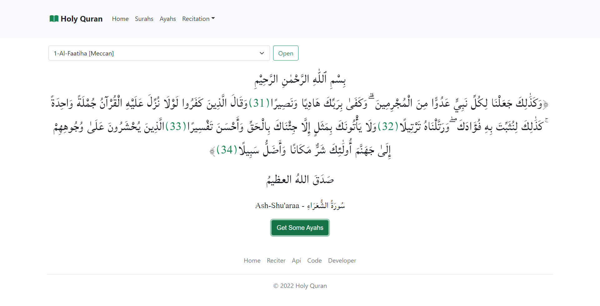
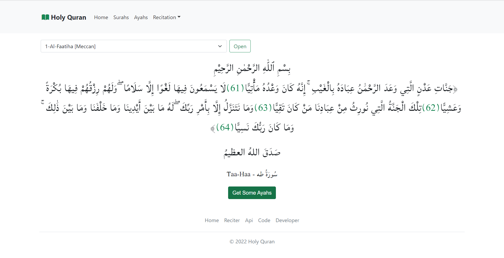
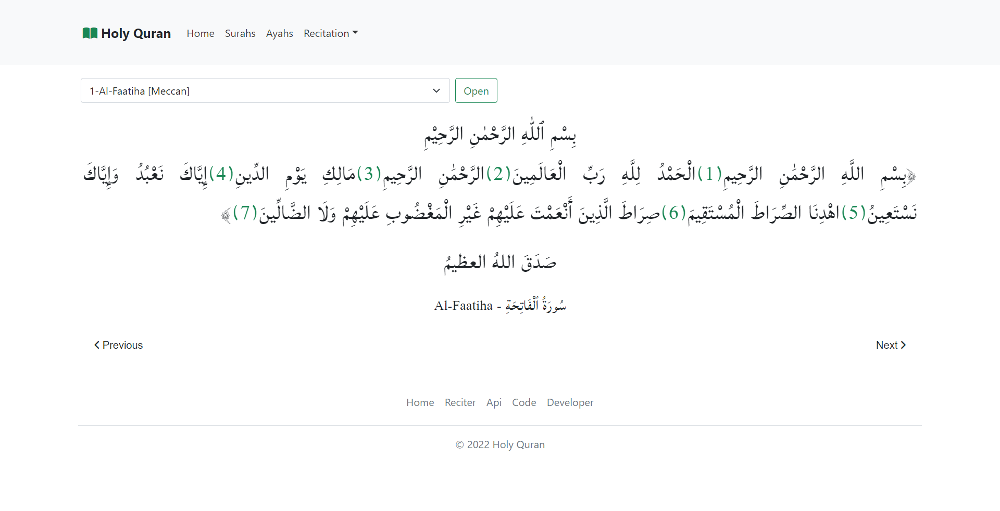
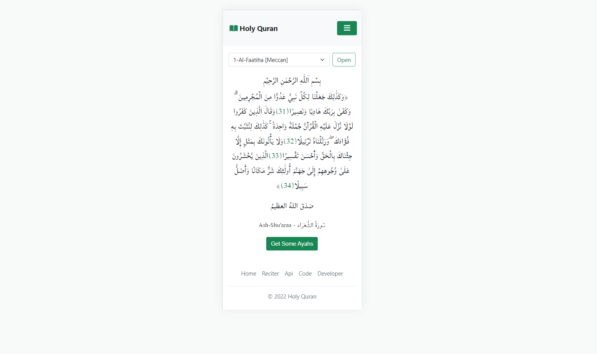
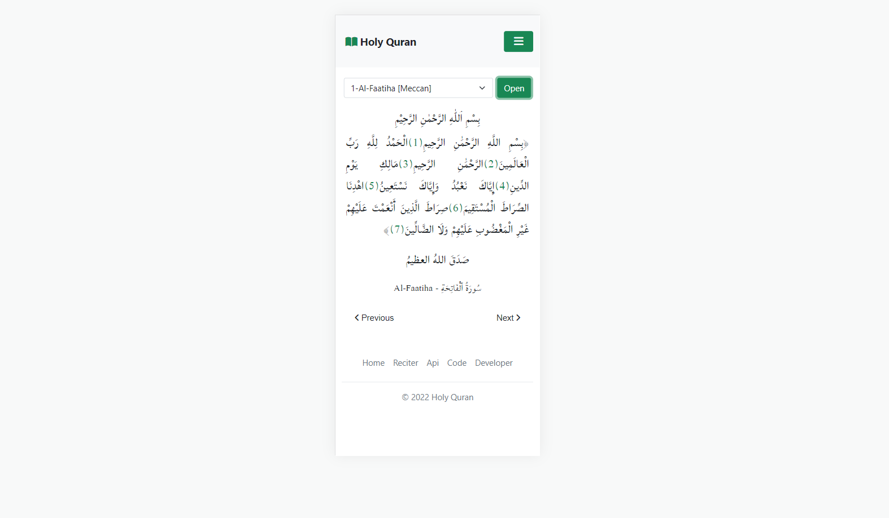

# Holy Quran is the holy book for muslims.
## here how it looks on browser
### here getting some Ayats Randomly to read, by hitting on 'Get Some Ayahs'.

### here getting the surah wanting to read, by choosing the surah you want to read.

## and here how it looks on mobile

## first to get all the package I am using you can run that command 
$ npm install

## then to get the application running can run that command 
$ npm start
or 
$ yarn start
