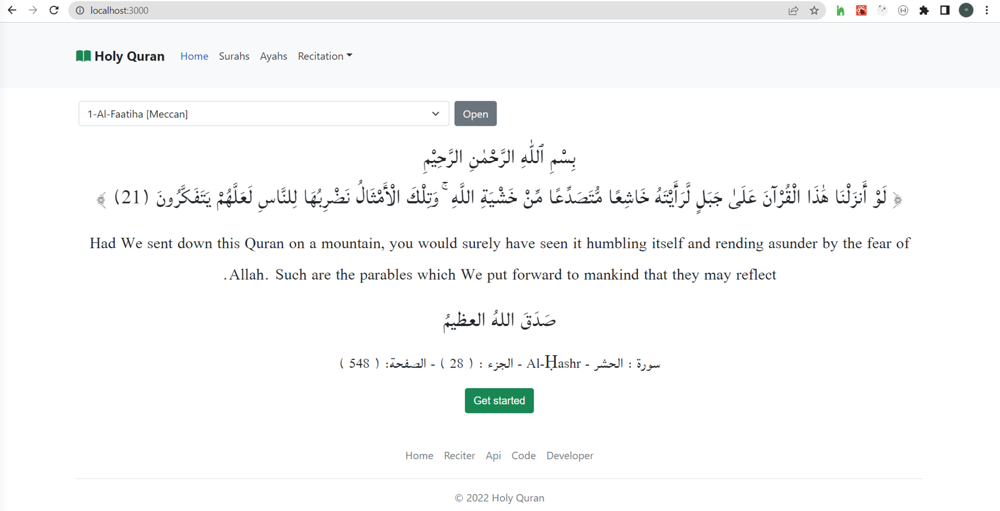
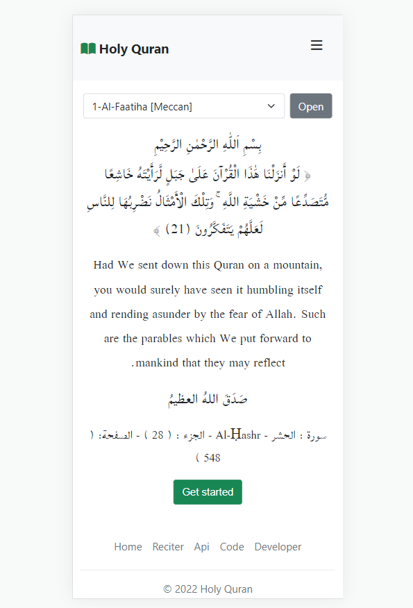

# Holy Quran is the holy book for muslims.
here it looks on web

and here it looks on phone

## first to get all the package I am using you can run that command 
$ npm install

## then to get the application running can run that command 
$ npm start
or 
$ yarn start
